# 线性代数

## 矩阵的运算

矩阵运算不满足交换律

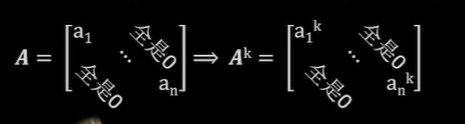

矩阵中不存在**矩阵+数字**，只有矩阵+数字E(E是单位矩阵)

已知AX=AB，不能推出X=B，要首先判断**A是否可逆**，如果可逆则经过变换得到有X=B

注意所有用到A的逆的证明，都需要先判断A是否可逆

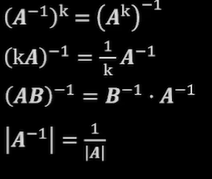

## 转置矩阵

 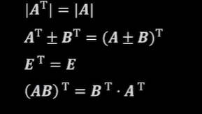

## 矩阵的范数

用于度量矩阵的，需要满足

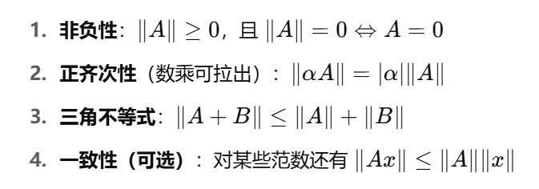

## 矩阵的迹

矩阵主对角线元素的和

## 矩阵的秩

矩阵的秩：矩阵中所有行向量极大线性无关组的元素个数，线性无关指的是向量不能被其他向量线性表示出来。

矩阵的秩可以指出矩阵有几个解

初等变换化成行最简形（或行阶梯形），然后数一下非零行数

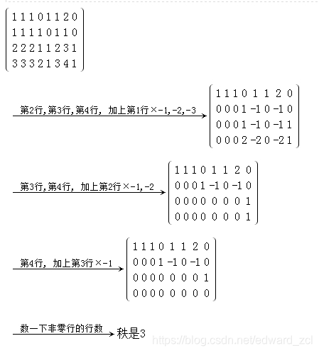

+ **转置后秩不变**
+ **r(A)<=min(m,n),A是m*n型矩阵**
+ **r(kA)=r(A),k不等于0**
+ **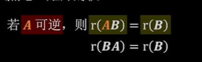**，或者会表示A的秩等于其阶数

列满秩：秩等于矩阵的列，组成矩阵的向量之间线性无关

行满秩：秩等于矩阵的行数

## 向量是否能组线性表示

通过求秩判断，如果原向量组的秩等于扩展后向量组的秩，那么说明给定的向量能被已有向量表示。

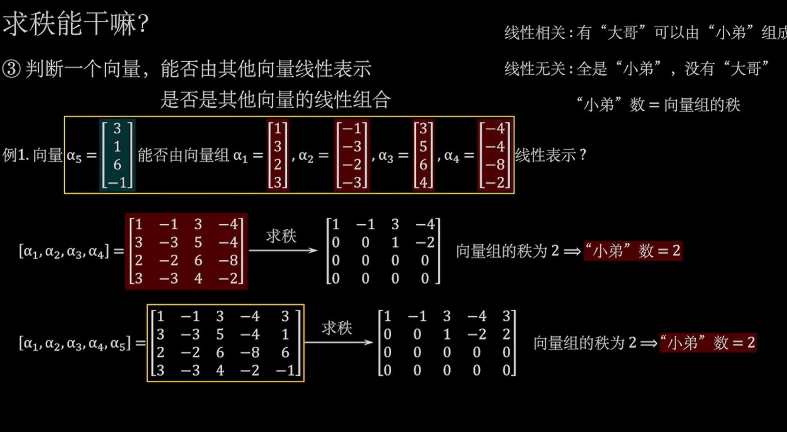

## 极大无关组

极大无关组：在线性无关的条件下，能找出的最大的向量子集

求法：求秩后，每行第一个非0数所在的列对应的向量

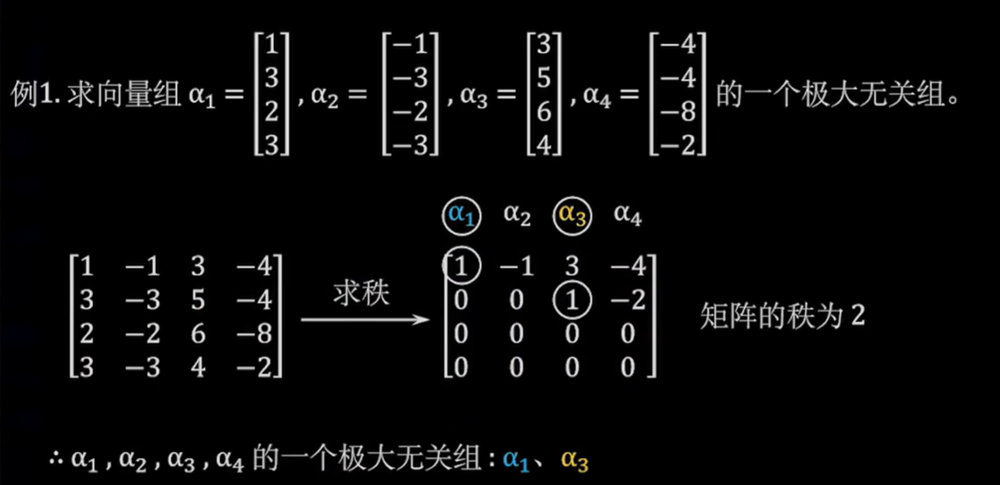

## Ax=b有解的条件

首先看增广矩阵的秩是否等于系数矩阵的秩，如果不等则无解`A的秩=分块矩阵 (A,b)的秩`

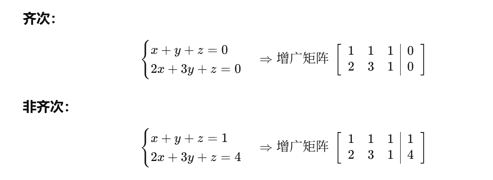

- 如果秩等于n，有唯一解，这里的n是列数
- 小于n，无穷多解
- 小于n且齐次，零解 + 无穷多个非零解

## 行最简型矩阵

1. 首先将矩阵化为阶梯型
2. 将每行的第一个非0数化为1
3. 保证每行第一个非0数所在列其余数都是0

## 用极大无关组表示向量

首先求解极大无关组，得到$\alpha_1和\alpha_3$是极大无关组

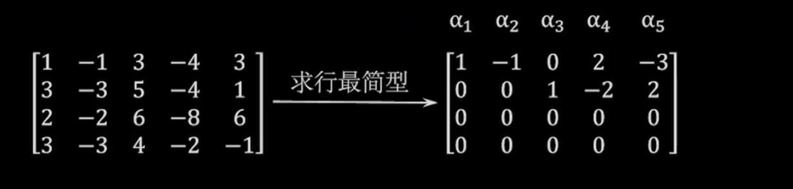

将其余向量用对应的数值(竖向)表示，以$\alpha_2为例$，其可以表示为：

$-1\times极大无关组的第一个+0\times极大无关组的第一个+0\times极大无关组的第一个+0\times极大无关组的第一个$

如果极大无关组数量不够，则认为是0

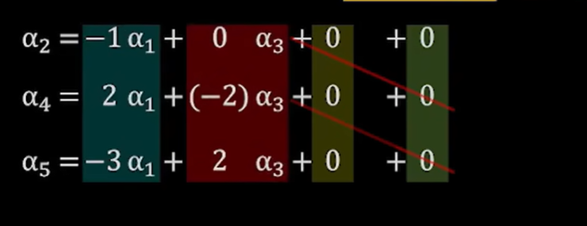

## 求方程组的通解

将增广矩阵化为行最简形后求解

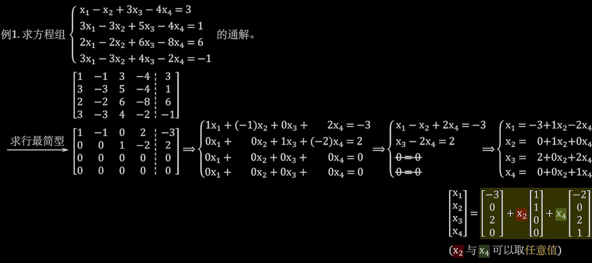

一般会将通解中的数换为K

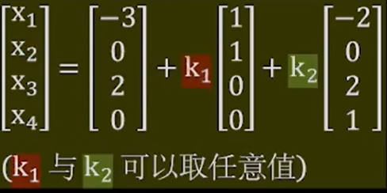

## 矩阵求逆

待定系数法

初等变化法

将矩阵和一个同大小的单位矩阵增广一下，然后进行初等变换

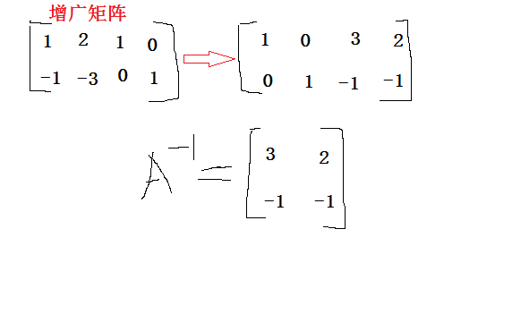

## 什么时候AB=BA

对角矩阵或者有倍数关系

## 行列式

行列式可以提取倍数，但是提取出的倍数要以行列式的阶数作为幂次

**行列式的值=主对角线元素乘积-负对角线元素乘积**

二列行列式很好求解

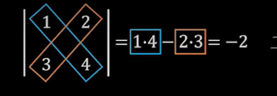

对于二阶以上的行列式，需要通过初等变化转换为为上三角形或下三角形，在求解对角线元素乘积之差

行列式的初等变换有一些额外的规则：

+ 可以对列进行操作
+ 可以将公因数提取到行列式外部
+ 交换某行(列)需要补一个-1

## 矩阵是否可逆

行列式的值可以用于判断**行数等于列数**的矩阵是否可逆，按照行列式的方法求解矩阵的值，**如果等于0，那么矩阵不可逆；反之可逆。**

或当矩阵是一个方阵且有矩阵的秩等于方阵阶数，矩阵可逆。

## 求矩阵的特征值

对于**行数等于列数**的矩阵求解特征值

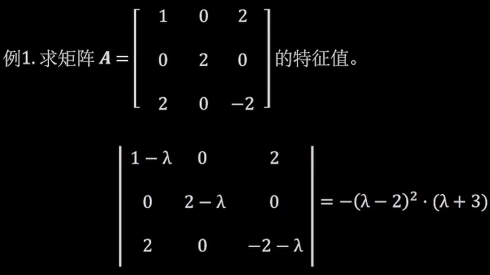

令该式子等于0，得到

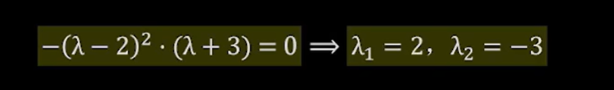

注意矩阵或者说方阵的特征值的个数等于其行数或者列数，最后解出了两个值说明第三个特征值和前面的某一个特征值重复了，因此有

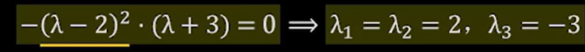

## 求解矩阵的特征向量

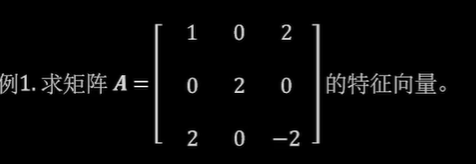

在得到特征值后，依次对每种特征值操作：将主对角线减去特征值，然后扩展一维0向量，求通解

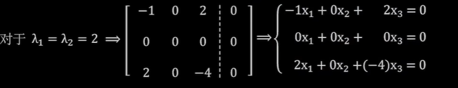

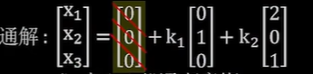

那么特征向量就是，但是注意特征向量与通解不同，这里的k1和k2不能全为0

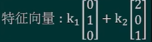

## 求对角矩阵和可逆矩阵

定义：矩阵A为n阶方阵，若存在n阶矩阵B，使得矩阵A、B的乘积为单位阵，则称A为可逆阵，B为A的逆矩阵。

首先求解特征值和特征向量

**主对角线上为特征值的矩阵就是对角矩阵，将k1,k2,k3对应的向量依次填入矩阵(竖向)就是可逆矩阵**

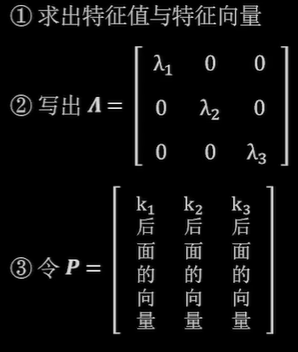

注意这里的可逆矩阵和矩阵的逆不是一个东西

## 正交矩阵

满足转置矩阵与自身的乘积为单位矩阵的方阵

首先求解出矩阵的特征值和特征向量，这里的特征向量需要合并以及将K提入

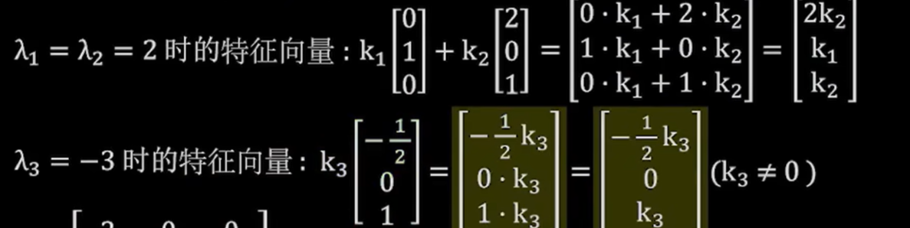

然后依次填入，得到

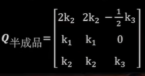

这里需要给定未知数的值，但每一列的取值可以不同即第一列的k1可以不等于第二列的k1，并且需要满足：任意两列之间的乘积等于0。一种简单的方法是：第一列的K1为0，其余设置为0；第二列的K2为1，其余设置为0；第三列的K3为1，其余设置为0，这样可以快速求解出满足条件的未知数。

最后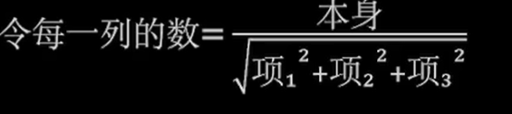

## 求二次型f的矩阵

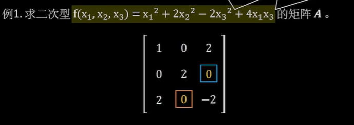

实际上就是将$x_ix_j$的系数划分一半给(i,j)一半给(j,i)

另一种题型是化二次型为标准型并写出相应的正交变换

这里需要求解特征值和正交矩阵

标准型：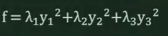

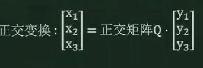

## 伴随矩阵

$A^*=|A|\times  A^{-1}$

## 矩阵常见问题

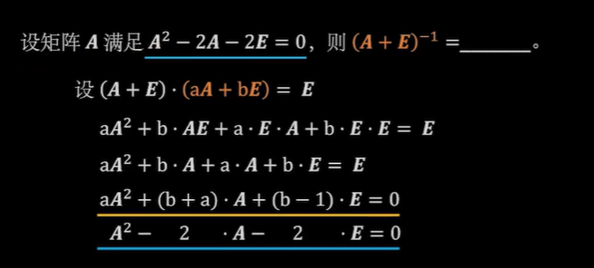

# 概率论

## 概率公式

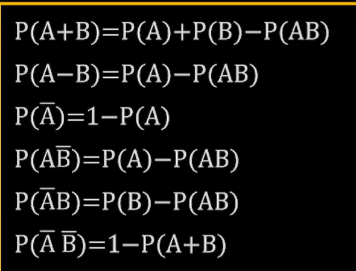

注意对立和互斥不等价；A包含于B，AB发生的概率等于小的事件发生的概率

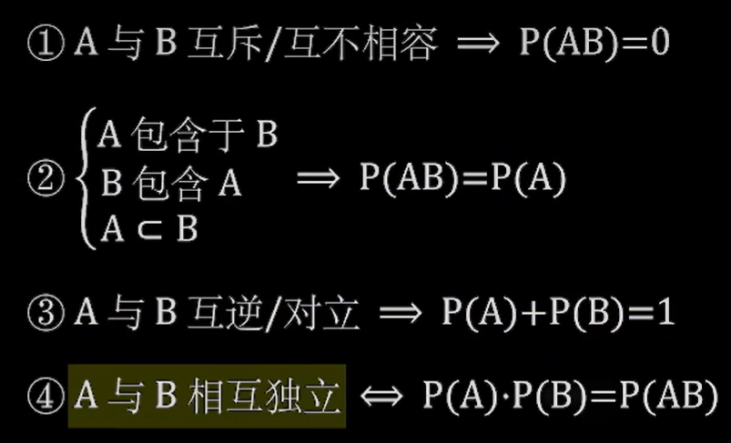

## 古典概型

**P{结果数}=符合结果的情况数*P{符合结果的某个情况}**

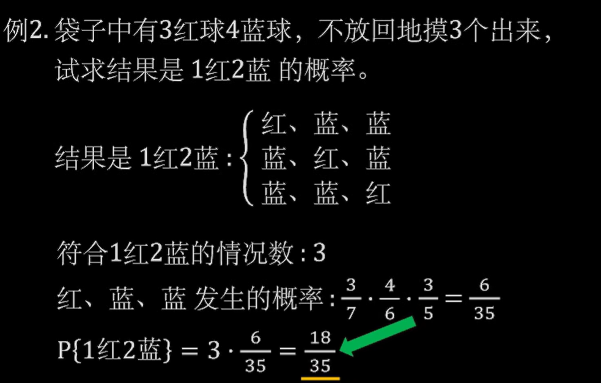

## 独立性、相关性、互斥性

独立——互不影响

相关性——变量之间存在某种趋势，正相关/负相关，独立=>不相关，但反过来不行。

互斥——不能同时发生

## 贝叶斯公式是什么，有什么应用

由果推因

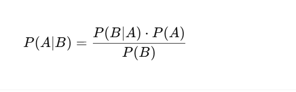

- $P(A|B)$：已知 B 发生的条件下，A 发生的概率（**后验概率**）
- $P(A)$：A 本身发生的概率（**先验概率**）
- $P(B|A)$：A 发生时，B 发生的概率（**似然**）
- $P(B)$：B 发生的总概率（**标准化因子**）

## 全概率公式

设 $A_1, A_2, \dots, A_n$ 是一个**完备事件组**（即两两互斥，且覆盖全集），那么对任意事件 $B$ 有：

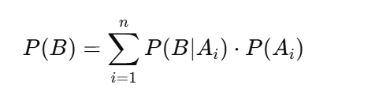

## 离散型随机变量

二项分布

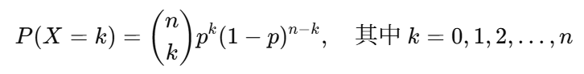

泊松分布

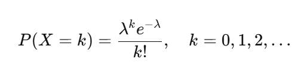

性质

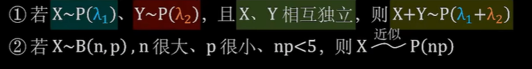

几何分布(直到第一次成功所需的操作次数)

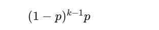

| 分布类型     | 分布记号                       | 期望（Expectation）           | 方差（Variance）                      | 备注说明                                         |
| ------------ | ------------------------------ | ----------------------------- | ------------------------------------- | ------------------------------------------------ |
| **二项分布** | $X \sim \mathrm{Bin}(n, p)$    | $\mathbb{E}[X] = np$          | $\mathrm{Var}(X) = np(1-p)$           | 成功次数总共 $n$ 次独立试验                      |
| **泊松分布** | $X \sim \mathrm{Poi}(\lambda)$ | $\mathbb{E}[X] = \lambda$     | $\mathrm{Var}(X) = \lambda$           | 事件单位时间平均到达率为 $\lambda$               |
| **几何分布** | $X \sim \mathrm{Geom}(p)$      | $\mathbb{E}[X] = \frac{1}{p}$ | $\mathrm{Var}(X) = \frac{1 - p}{p^2}$ | 第一次成功所需试验次数（支持集为 $1,2,3,\dots$） |

## 连续型随机变量

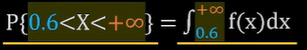

F(x)累积分布函数，指随机变量取值不超过x的概率，在正无穷时为1，负无穷时为0，求导得到f(x)概率密度函数

连续型随机变量在某点的概率等于0

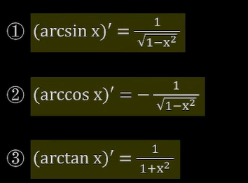

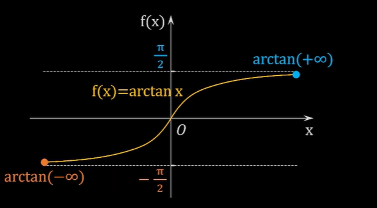

均匀分布

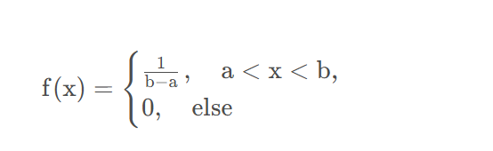

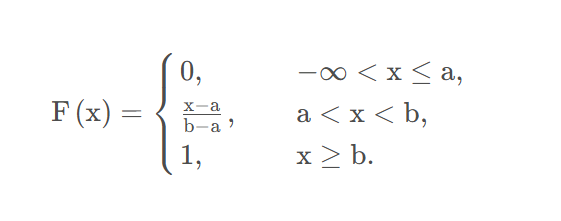

指数分布

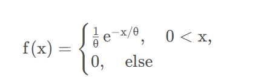

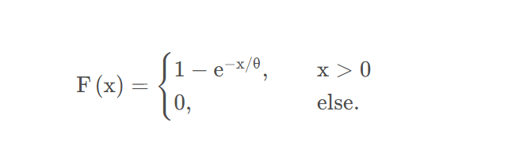

指数分布具有无记忆性

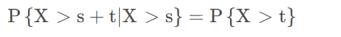

正态分布

**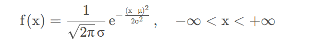**

正态分布关于u对称，在u处达到最大值，通过$\frac{x-\mu}{\delta}$可以转换为标准正态分布。

| 分布名称                         | 密度函数 $f(x)$                                            | 定义域                 | 期望 $\mathbb{E}(X)$ | 方差 $\mathrm{Var}(X)$ |
| -------------------------------- | ---------------------------------------------------------- | ---------------------- | -------------------- | ---------------------- |
| 均匀分布 $U(a,b)$                | $\frac{1}{b-a}$                                            | $a \le x \le b$        | $\frac{a+b}{2}$      | $\frac{(b-a)^2}{12}$   |
| 指数分布 $\mathrm{Exp}(\lambda)$ | $\lambda e^{-\lambda x}$                                   | $x \ge 0$              | $\frac{1}{\lambda}$  | $\frac{1}{\lambda^2}$  |
| 标准正态分布 $N(0,1)$            | $\frac{1}{\sqrt{2\pi}} e^{-x^2/2}$                         | $-\infty < x < \infty$ | $0$                  | $1$                    |
| 正态分布 $N(\mu,\sigma^2)$       | $\frac{1}{\sqrt{2\pi\sigma^2}} e^{-(x-\mu)^2/(2\sigma^2)}$ | $-\infty < x < \infty$ | $\mu$                | $\sigma^2$             |

## 期望和方差

期望是度量一个随机变量取值的集中位置或平均水平的最基本的数字特征

方差用于分析某组数据内部的集中程度或者是离散程度，

- 方差越小，数据越集中，内部波动越小，比较稳定
- 方差越大，数据的离散程度越高，内部波动大，不稳定

离散型随机变量

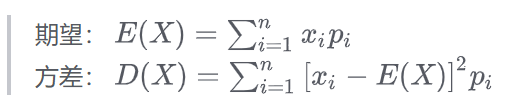

连续型随机变量

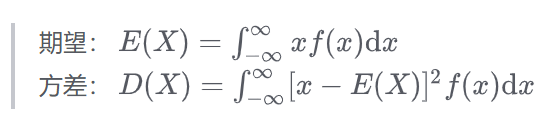

期望运算的性质

方差运算的性质

二者之间的联系

协方差

当X=Y时，求解的就是X or Y 的方差

相减也是可以拆开的

相关系数，如果等于0，表示两个变量不相关，不相关推不出独立，独立可以推出不相关

## 切比雪夫不等式

可以理解为一个值落在与期望较远的位置的可能是比较小的

## 中心极限定理

如果一组变量服从独立同分布，那么它们的和近似正态分布，当n趋于无穷时，则精确服从正态分布

## 数理统计三大分布

$χ^2$分布

 t分布

F分布

## 最大似然估计

利用已知样本信息反推最有可能导致这些样本结果出现的模型参数值——在所有可能的参数中找一个能使结果最有可能发生的(既然已经发生了，为什么不然它发生的概率最大)

有一枚**来路不明的硬币**，你不知道它正面（记为1）朝上的概率是多少。现扔了10次，发现：7次正面，3次反面，那么直觉上这么硬币向上的概率为70%，用最大似然估计求解就是找到一个参数p使得$p^7\times (1-p)^3$最大，那么求导后带入p=0.7可以得到最大值。

## 大数定律

弱大数定律(辛钦定理，独立同分布)：样本均值依概率收敛于期望

强大数定律：样本均值以概率1收敛于期望

切比雪夫大数定律(独立)：样本均值趋近于总体均值

伯努利大数定律(二项分布)：事件发生的频率等于概率

## 抽样分布

卡方分布，t分布，F分布

## 熵

信息论中用于衡量信息的不确定性，越混乱，不可预测的数据熵越大，反之越有规律可以预测的数据熵就小。

# 高数

## 不定积分和定积分

不定积分是导数的逆运算，也叫反导数

定积分是求解一个函数的图像在比区间上和X轴围成的面积

## **什么叫微分中值定理？**

给定平面上固定两个端点的可微曲线，那么曲线两个端点之间必然有一点，在该点的斜率等于两个端点连接起来的直线的斜率。

罗尔中值定理

1. 在闭区间[a,b]上连续
2. 在开区间(a,b)上可导
3. 有f(a)=f(b)

拉格朗日中值定理，罗尔中值定理更**一般**的形式。在闭区间内连续开区间内可导，那么有

柯西中值定理，有两个函数f和g在闭区间内连续，开区间内可导，那么有

## 积分中值定理

函数f在闭区间[a,b]上连续，那么在积分区间中至少存在一点使得

推广：函数f在闭区间[a,b]上连续，函数g在闭区间[a,b]上连续不变好，那么有

念法：从 $a$ 到 $b$ 的 $f(x)g(x)$ 的定积分，等于某个点 $\xi$ 处的 $f(\xi)$，乘以从 $a$ 到 $b$ 的 $g(x)$ 的定积分。

## **什么是数列的极限，也就是说一个数列xn，收敛于a，你如何定义它？**

令a为一个定数，对任意给定的正数ε，总存在正整数N，使得n>N时有

则称数列$a_n$收敛于a，定数a记为数列$a_n$的极限。

## **初等函数是什么？基本初等函数有哪几种？**

基本初等函数：幂函数，指数函数，对数函数，三角函数，反三角函数。

初等函数：由基本初等函数经过有限次的有理运算以及有限次的函数复合产生的。

## 什么是凸函数

函数曲线上任意两点连成的线段皆位于图形上方

## ex 的泰勒展开式

## 内积

两个向量相乘得到的一个标量，内积越大说明两个向量方向越近，内积为0则表示垂直。

## 欧式空间是什么

二维平面，三维平面就是欧氏空间，可以计算距离和夹角。

# 数据结构

## 数据结构的定义

逻辑结构，存储结构，数据的运算

## 数据结构如何划分

## **如何判断一个单链表是否是循环链表（要给出一个比遍历更快的方法）**

快慢指针法：两个指针一个每次前进1步、一个每次前进2步，相遇则循环

## **说下快排过程**

分治法，选定一个分界值，分界值左边的都小于分界值、分界值右边的都大于分界值

## 快排时间复杂度

nlogn和n的平方，最坏是因为每次用于划分的数(原始数组有序)，恰好会把数组分为1和n-1，最好情况则是每次划分都很平衡切好分为两半。

## 如何判断有向图是否有环？

拓扑排序

## B树

B树是一个多叉平衡搜索树，每一个节点可以有多个值9关键字)，且包含对应记录的指针，节点内的值是有序的，也可以有多个分支。为磁盘/大数据存储系统设计的一种高效可扩展的数据结构，数据库的索引用的就是B树。

[参考视频](https://www.bilibili.com/video/BV1JU411d7iY?spm_id_from=333.788.player.switch&vd_source=63004f7ee2f738d6adc086e00ebcede2)

考虑6,13这个节点，它的子树1,4 8,11实际上对应的就是6的左右子树，8,11 14,16就是13的左右子树

对于M阶B树，每个节点最多有M个分支，包含M-1个元素；最少ceil(m/2)个分支，包含ceil(m/2)-1个元素，根节点可以是2个分支以及1个元素。

### 查找

以找28为例

这里回去找43的左子树，但是其左子树不存在，相当于走到了失败节点上，因此查找失败。

### 插入

以插入20为例

最后会走到23所在节点，这里不是继续往下走而是直接将值加入到23所在的节点。

插入时可能会违反B树的规则，即一个节点中的元素数超过上限了。假设现在插入的17，那么它会被添加到3,14这个位置，此时节点内元素的个数会超出上限(上溢)，此时需要进行调整——将中间位置的元素上移到父节点，并将该节点划分为左右两部分。

显然的上移后依然可能会违反规则，因此继续递归处理

 B树的构建也是这样一点点调整出来的。

### 删除

[参考视频](https://www.bilibili.com/video/BV1JU411d7iY?spm_id_from=333.788.player.switch&vd_source=63004f7ee2f738d6adc086e00ebcede2)

删除B树上的非叶子节点，和二叉搜索树一样用中序的后继替换，然后删除替换后的节点。然后删除界点活可能会违反B树的规则——节点内元素的个数不够了(下溢)。

如果兄弟节点可以借一个，那么就从兄弟节点处借一个节点过来，左右随意。

这里不能借节点中的任意一个，做法是：将兄弟节点对应的父节点添加给下溢出的节点，然后将兄弟节点的中最大/最小(取决于是左兄弟还是右兄弟)的元素值上移，保证有序，父下来子上去。

注意如果兄弟节点也有子树那么需要移动该节点最左/最右的子树移动给溢出节点。

如果兄弟节点不够借，那么需要合并

和左兄弟合并——将其父节点移动到左兄弟，然后再合并，合并时也需要移动对应的子树

这样父节点也会减少一个元素，可能发生下溢出，因此递归处理

## B+树

叶结点层包含全部的关键字以及指向相应记录的的指针，非叶子节点只是作为索引，节点之间通过链表连接，这样在顺序查找时可以避免中序遍历的方式在树上来回移动，兼顾了顺序查找和随机查找，以及范围查找(顺寻查找+随机查找)。

和B树不同，m个分支的节点有m个元素，同时非叶子节点的每个元素对应其子节点的最大值，叶子节点包含一个指向记录的指针

B+树的查找需要一直走到叶子节点，不能中途停下

## 默克尔树

每个叶子节点是数据的哈希值，非叶子节点又是子节点的哈希值。

在密码学和区块链中十分重要，能高效的检验数据的完整性和一致性。

# 计算机网络

## 各层以及各层的协议

+ 应用层：应用程序之间提供数据传输服务，HTTP.,SMT,POP3,DNS
+ 传输层：为进程之间的提供服务，TCP UDP
+ 网络层：主机之间通信服务，ARP,ICMP,BGP
+ 链路层：相邻网络节点之间的数据传输，CSMA/CD
+ 物理层：在线路上传输bit

## 电路交换，报文交换和分组交换的区别

1. 电路交换——整个报文的比特流连续的从源点到达终点，类似于在一个管道中传输
2. 报文交换——整个报文先传送到相邻的节点，全部存储下来后，转发到下一个节点
3. 分组交换——单个分组先传送到相邻的节点，全部存储下来，转发到下一个节点

## 三次握手

防止已经失效的连接请求突然传送到了服务端，因而产生错误。这里已失效的连接请求指的是client发送的第一个连接请求并没有丢失，而是在延误了一段时间后才到达server，而服务器收到了这个报文后，如果不采用三次握手会认为连接请求建立了，然后一直等待client发送信息，导致资源浪费。

## 四次挥手

服务器接收客户端的中断请求时可能还有一些数据没有发送完毕，这时会先回复ACK表示收到了断开连接的请求，等到数据发送完之后再发Fin，断开服务器到客户端的数据传送。

## 流量控制

发送方发送速度过快，导致接收者来不及接收，那么就会发生分组丢失，流量控制的目的就是**防止分组丢失**。

接收方返回的 ACK 中会包含自己的接收窗口的大小，并且利用大小来控制发送方的数据发送。

假设在将**rwnd=0**发送给发送方后**接收方不会再返回任何数据**，这时因为**发送方无法知道接收方的缓存是否有新的空间**，发送方会被**阻塞**将不再发送数据。为此，**当接收方rwnd=0时**，发送方**会继续发送只有一个字节的报文段**，最终缓存开始清空，这些报文段会被**确认**，确认报文中将带有**非0的rwnd**

慢启动是TCP建立连接后的**第一个模式**，该模式下cwnd通常被**初始化为1MSS**，慢启动阶段cwnd**每经历一个RTT**(TCP一次性将窗口中所有的报文发出，所有报文确认的事件近似一个RTT)就会**翻倍**，慢启动的目的就是为了**快速找到上限**。

+ 出现**超时**，设置**阈值ssthresh为cwnd/2**，然后将**cwnd设为1**，这里试探到了上限，然后继续指数增长
+ **当cwnd到达阈值时**，会进入**拥塞避免**模式
+ 接收到**三次冗余确认**，进入**快速恢复**阶段，设置**阈值ssthresh为cwnd/2**，然后**cwnd = ssthresh + 3MSS**

**拥塞避免是一个速率缓慢且线性增长的过程**，这里每经历一个RTT，cwnd就增加**1**，假设`cwnd`包含`10`个报文的大小，则每接收到一个确认报文，`cwnd`增加1/10 MSS

+ 出现**超时**也就是出现拥塞，设置**阈值ssthresh为cwnd/2**，然后将**cwnd设为1**，进入**慢启动**，再次试探上限
+ 接收到**三次冗余确认**，进入**快速恢复**阶段，设置**阈值ssthresh为cwnd/2**，然后**cwnd = ssthresh + 3MSS**

收到三次冗余确认可能是出现了拥塞，但是直接进入到慢启动有点鲁莽，因为既然可以收到冗余的确认报文，表示拥塞不会太严重。

快速恢复阶段，每收到一个冗余确认报文(旧的)，cwnd就增加**1**

+ 接收到**新的确认报文**，**cwnd设置为ssthresh**，然后进入**拥塞避免**
+ 出现**超时**，设置**阈值ssthresh为cwnd/2**，然后将**cwnd设为1**，进入**慢启动**

简单总结，一旦超时就重置阈值和cwnd，重新开始慢启动；收到三次冗余确认，重置阈值和cwnd，进入快速恢复；慢启动达到阈值，进入拥塞避免；快速恢复收到新的确认报文进入拥塞避免；

## 拥塞控制

网络中很少有两台主机是直接相连的，发送到网络中的数据会通过**路由器转换**，但是路由器不是直接就能转发的，它首先要将收到的数据放入到内存中，再从中取出进行转发，而**路由器的内存是有限的**，同一时间到达某个路由器的数据太多，这个路由器将无法接收所有的数据，只能将一部分丢弃；或者同一台路由器数据太多，后面到达的数据将要等待较长的时间才会被转发。**网络中数据太多，导致某个路由器处理不过来或者处理地太慢，就是网络拥塞。**

拥塞控制就是在网络发送拥塞时，**减少向网络中发送数据的速度，防止恶性循环，在网络空闲时提高发送数据的速度，最大限度地利用网络资源。**

TCP拥塞控制算法包括三部分：**慢启动，拥塞避免，快速恢复**，其中前两个是**一定包括**的部分。

## 拥塞控制和流量控制的区别

拥塞控制：拥塞控制是作用于网络的，它是防止过多的数据注入到网络中，避免出现网络负载过大的情况	

流量控制：流量控制是作用于接收者的，它是控制发送者的发送速度从而使接收者来得及接收，防止分组丢失的

## 为什么有了MAC地址，还需要IP地址

需要IP地址进行路径选择

## DNS的工作原理

DNS解析有递归和迭代两种：

+ 递归：发送请求后等待返回结果
+ 迭代：当根域名服务器收到本地域名服务器发出的迭代查询请求报文时，要么给出所要查询的IP地址，要么告诉本地服务器：“你下一步应当向哪一个域名服务器进行查询”。然后本地域名服务器再进行查询。

## ipv6和ipv4的区别

ipv6是128位地址，冒号十六进制，首部没有可选项，不允许中间路由器分片组装，只能由发送端处理

ipv4是32位地址，点分十进制

# 操作系统

## 线程的几种状态

新建，阻塞，执行，执行

## 计算机开机执行的第一条指令地址是什么

取决于处理器架构，对于x86来说是0xFFFFFFF0

## 解释一下join函数的意义，如何使用

用于等待子线程结束，它会阻塞父进程，等待子进程结束后，再唤醒父进程。

## 中断的分类有哪些？中断的实现过程？

## 文件的共享方式有哪些？

# 编译原理

## 图灵机是什么

图灵机是一种数学模型，它由三部分组成：

1. 无限长的纸带，纸带上被分为一个一个格子，每个格子可以储存一个符号
2. 读写头，可以去读取纸带上的符号，写入一个新符号，移动
3. 有限状态控制器，有若干个状态，其中一个是初始状态，根据当前状态和读到的符号决定下一步的操作

能够模拟任何算法。

# 数据库

## 三级模式两级印象

三级模式和两级映像

+ **模式(概念模式)：所有数据的逻辑结构和特征的描述，就是常用的基本表**
+ **外模式(用户模式)：用户用到的那部分数据的描述，对应视图**
+ **内模式(存储模式)：是对数据物理结构和存储方式的描述，是数据在数据库内部的组织方式**

视图是**虚表**，是对一个或多个表的查询结果的`逻辑表示`，是数据查询的`基本对象`，它**不储存数据**，而是储存一条查询语句的**结果**的定义，每次访问视图都会**执行这条查询**。

两级映像，用于保证物理独立性和逻辑独立性

- 外模式/模式映像：**定义外模式和模式之间的对应关系(表和视图之间的映像)，保证数据的逻辑独立性，若表中的数据改变，只需修改该映射，无需修改应用代码。**
- 模式/内模式映像：**表和物理存储之间的对应关系，保证数据的物理独立性，若改变了数据的存储方式，只需修改该映像，无需修改应用代码。**

## 数据库中的选择操作，什么时候应该用到索引？

索引是为表中一列或者多列建立的数据结构，用于快速定位满足条件的位置。

数据量特别大的时候，使用索引查找不必扫描整个表

# 机器学习

## 机器学习是什么，可以做什么

机器学习是使计算机从数据中自动学习经验，并在新的数据上进行预测或分类的的技术

# 政治

## 我国的反腐行动如何

## 对于社会核心价值观的了解

# 其他

## 论文级别

分为ABC类，A——国际顶级会议或期刊(CVPR)，B——国际权威会议或期刊(ECCV)，C——国际有影响会议或期刊(ICPR)

## 编译型语言和解释型语言

编译型语言：源代码通过编译器一次性转换为机器语言，然后再执行。效率更高，但是编译后的可执行文件无法跨平台，因为编译出的机器码与处理器和操作系统绑定

解释型语言：源代码通过解释器逐行读取并执行。调试更快，跨平台性好，只需安装解释器。

java是混合型语言，源代码现由编译器编译为平台无关的字节码，然后由跨平台的JVM解释执行，综合了两者的优点。

## 关键路径是什么

从起点到终点所经过的路径中，具有最长总耗时的一条路径，其上的任务称为关键任务

