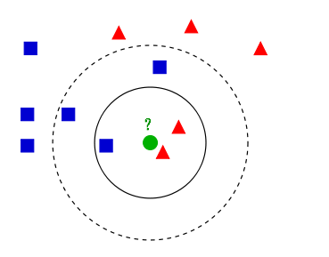
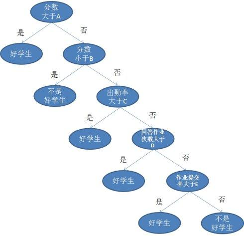

# 简单介绍一下自己

我叫周明宇，来自重庆邮电大学软件工程专业，现在是大三在读学生，目前的专业课GPA是3.60，现在是年级第三，具有扎实的编程基础，在算法和数据结构方面积累了较多的经验，有丰富的竞赛和社会实践经历，动手能力强，有较强的自驱力。


# 社交博客应用

flask用Python编写的**轻量级Web应用框架**，只提供最基本的Web功能（路由、请求处理、响应等），其他靠扩展包。

一个完整的博客平台，后端采用Flask框架，前端使用Bootstrap，实现了用户注册、登录、发文、评论、关注等核心功能。后台通过 Flask Blueprint 实现模块化管理，将用户、文章、评论等逻辑解耦，提高了项目的可维护性和扩展性。数据层使用SQLAlchemy ORM 管理，部署时集成 Docker 保证跨平台运行一致性。

**Bootstrap**是一个开源的前端开发框架，提供了很多现成的CSS样式

**SQLAlchemy ORM** 是对象关系映射，能用python操作数据库

开启QQ邮箱的SMTP服务，生成授权码，然乎写入环境变量进行配置。

单例模式的对象在整个系统中只有一份，多例模式可以有多个实例，我的应用属于单例开发，因为没必要为每个请求都创建一个对象，浪费CPU和资源。

可扩展性强，修改了数据库的字段可以使用扩展做数据库迁移，而不会丢失所有数据。


## 路由机制（Routing）

Flask用`@app.route()` 装饰器来定义URL路径Python函数之间的映射

## 蓝图

Blueprint是Flask的**模块化机制**，把用户功能单独写成一个模块，然后在主应用中注册它

## 模板引擎

Jinja2是Flask默认的模板引擎，用来渲染HTML页面

## 数据库

SQLite是一个**轻量级的关系型数据库**，不需要服务器，数据保存在本地


## 你为什么选择 Docker 而不是虚拟机？

Docker比VM更轻量、高效，它共享宿主机的操作系统，启动速度更快


# kaggle泰坦尼克号生存预测

## 是什么？为什么？怎么做？

这是Kaggle平台上最经典的入门级机器学习项目之一，要求根据泰坦尼克号乘客数据，预测每位乘客是否幸存。这是一个**二分类问题**，

数据集中包含了乘客的多个属性信息，如：

- 性别 (`Sex`)
- 年龄 (`Age`)
- 舱位等级 (`Pclass`)
- 家庭成员数量（`SibSp`、`Parch`）
- 登船港口 (`Embarked`)
- 船票信息 (`Ticket`, `Fare`)
- 舱位编号 (`Cabin`) 等


我在准备数学建模比赛时，初步接触到了一些机器学习的概念和方法，为了在建模比赛中更熟练地应用机器学习的知识，汲取kaggle 找了这个比赛练习。

这个项目具备以下几个优势：

- 数据量适中，适合练习与快速迭代
- 涉及典型的预处理场景：缺失值、类别变量、特征选择等
- 可以尝试不同模型，如逻辑回归、决策树、随机森林、SVM、XGBoost 等
- Kaggle提供实时反馈机制，便于验证模型效果


1. **探索性数据分析（EDA）**
    1. 帮助识别明显的错误：缺失不合理的值，比如Age缺失值较多；Cabin缺失严重决定剔除；发现Embarked有缺失值；，
    2. 更好地理解数据中的模式：明确了女性存活率高；头等舱更安全；小孩存活率高。识别为重要变量不丢弃
    3. 检测异常值或异常事件:发现票价里面有一些异常值
    4. 并找到变量之间的有趣关系：发现SibSp和Parch对结果有相同的影响，将两个变量融合成一个更“语义明确”的变量， **降低维度，减少噪声**，提升模型的可解释性与泛化能力

2. **特征工程**
   1. 对缺失值进行了合理填充。`Age` 字段缺失较多，依据乘客的头衔对其进行分组填充平均值；
   2. `Embarked(登船地点)` 字段的缺失项以众数填充；
   3. 连续变量进行了离散化处理，例如将年龄区间 [0, 80] 分为 5 个年龄段；构造了新的特征如 `FamilySize`（家庭成员数量）和分段的 `Fare`；
   4. 去除了对建模贡献较小或可能引入噪声的特征，如 `Name`、`Cabin`、`Ticket` 及原始连续变量。
3. **模型构建与比较**
    尝试了多种分类模型，包括逻辑回归（Logistic Regression）、随机森林（Random Forest）、K 近邻（KNN）以及支持向量机（SVM），对比它们在当前特征下的表现。
4. **模型调优**
    通过网格搜索（Grid Search）系统地调整模型超参数，以获得更优的预测效果。
5. **模型评估**
    使用交叉验证方法对模型进行评估。结果显示，SVM 模型的表现最佳，最高预测准确率达到了 82%。


连续值转换为离散值的目的：

- 捕捉非线性模式，对于年龄变量，0到10岁生还率高，30-50岁生还率低，60岁之上生还率高，
- 提升模型的稳定性，降低噪声
- 提升模型表现
- 方便解释，可视化


## 介绍一下梯度下降

梯度下降是一种用于求函数最小值的算法，其背后的思想是：**初始时选择一个任意的参数组合计算代价函数，然后寻找下一个能让代价函数下降最多的参数组合，一直重复操作直到到达一个局部最小值，初始时选择不同的参数可能会得到不同的全局最小值。**

BGD批量梯度下降，使用全部的数据计算梯度

- 优点：并行计算，当函数位凸函数时一定能得到全局最优
- 缺点：收敛慢


SGD随机梯度下降，每次抽取一个样本计算梯度

- 优点：训练速度快
- 缺点：局部最优


mini-batch SGD小批量随机梯度下降

- 优点：并行，速度快
- 缺点：学习率不好调


## 逻辑回归

**逻辑回归**是一种广泛应用于分类问题的统计方法。它通过使用**逻辑函数**（Sigmoid 函数）将线性回归的输出映射到0和1之间，从而预测某个事件发生的概率。逻辑回归的损失函数是对数损失函数，通常使用**梯度下降法**来优化损失函数，求解参数。它在许多领域中都有应用，例如客户购买预测、借款人违约预测等。逻辑回归虽然名字中带有“回归”，但实际上它是用于分类的算法。

逻辑回归的假设模型是：**对于给定的输入变量，根据选择的参数计算输出变量等于1的可能**


其中g是sigmod函数，


当g(z)>=0.5时预测y=1，反之y=0，根据图像可知，z求出的结果>=0时y=1，反之y=0


因此当给定参数时，通过与0比较大小可以得到一条决策边界。


逻辑回归的代价函数定义为


从图像上理解：当目标值y是1，h(x)的结果表示输出量是1的可能，当可能越大代价函数就越小，当h(x)趋近于0时，代价函数也会越来越大(因为与正确结果相悖)


将式子合并有


使用梯度下降，代价函数有


最后有


注意下述的是实现中使用Truncated Newton Conjugate-Gradient（TNC）算法——截断牛顿共轭梯度(原理较为复杂)来寻找最优参数

fmin_tnc(func=cost,x0=theta,fprime=gradient,args=(x,y))，其中theta必须是行向量形式，且cost和fprime的第一个参数必须是theta

```python
filename='ex2data1.txt'
data=pd.read_csv(filename,header=None,names=['Exam1','Exam2','Admitted'])

# 按照类别划分数据
pos=data[data['Admitted']==1]
neg=data[data['Admitted']==0]

# 绘图
fig,ax=plt.subplots(figsize=(12,8))
ax.scatter(pos['Exam1'],pos['Exam2'],color='blue',label='AC')
ax.scatter(neg['Exam1'],neg['Exam2'],color='r',marker='x',label='WA')
ax.legend()

# plt.show()

# sigmod函数
def sigmod(x):
    return 1/(1+np.exp(-x))

# 常数项
data.insert(0,'Ones',1)
cols=data.shape[1]

# 正则化
data.iloc[:,1:-1]=(data.iloc[:,1:-1]-data.iloc[:,1:-1].mean())/data.iloc[:,1:-1].std()

# 输出和输出 X.shape, y.shape分别是((100, 3), (100, 1))
x=np.array(data.iloc[:,:cols-1].values)
y=np.array(data.iloc[:,cols-1:].values)

# 注意参数初始化为行向量，在计算时可以通过reshape(-1,1)变为列向量
theta=np.zeros(cols-1)

# 代价函数
def cost(theta,X,y):
    # 注意维度
    return -np.sum(y*np.log(sigmod(X@theta.reshape(-1,1)))+(1-y)*np.log(1-sigmod(X@theta.reshape(-1,1))))/len(X)

# 计算步长，没有执行梯度下降
def gradient(theta,X,y):
    paramater=theta.shape[0]
    term=np.zeros(paramater)
    error=(sigmod(X@theta.reshape(-1,1))-y)

    for j in range(paramater):
        # 下面是向量乘法
        term[j]=np.sum(error*X[:,j].reshape(-1,1))/len(X)
    return term

# fmin_tnc是一种常用的寻找最优参数的算法
# 按照参数的要求待机函数和梯度函数中第一个参数必须要(n,)的参数向量，其他的参数通过args用元组的形式传入
best_theta,_,_=opt.fmin_tnc(func=cost,x0=theta,fprime=gradient,args=(x,y))

# 给定参数和输入预测结果
def predict(X,theta):
    possible=sigmod(X@theta.reshape(-1,1))
    return [1 if x>=0.5 else 0 for x in possible]

# 比较预测值和真实值
res=predict(x,best_theta)
compare=[ 1 if i==j  else 0 for i,j in zip(res,y)]
accury=sum(compare)/len(compare)
print(accury)
```


注意逻辑回归一次只能处理二分类问题，因为我们根据h(x)的输出，来划分1和0，因此对于多个类别，需要为**每个类别训练一个模型**，求解某个类别时使用对应的模型来处理数据。


[多分类的逻辑回归](./个人代码实现/ex3.html)


## SVM

基本思想：在二分类问题上，找到一个超平面，使得使两类数据离这个超平面越远越好，对于线性可分的数据来说，超平面有无数多个，但是**几何间隔最大的只有一个**。

当数据无法在**原始特征空间**中用一条直线(二维)，或一个平面(三维)分开时，就需要用**核函数**把数据**映射到更高维的空间**。

只适合于**小样本**


## KNN

给定一个数据集，对于新的输入实例，在训练集中找到与该实例**最邻近的K个实例**，这K实例的**多数**属于某个类，就把这个输入实例分类这个类中(**少数服从多数**)。



如上图所示，绿色的点是待分类的，如果K=3，那么新的实例绿色就属于红色，如果K取到5，那么就属于蓝色，这里得距离度量可以是欧氏距离或者曼哈顿距离。

K值得选取需要通过**调参**获得，在训练模型之前需要进行**归一化**处理。


## 决策树

决策树是一种树形结构，内部节点表示一个属性上的判断，分支表示判断结果的输出，叶子节点表示分类结果，决策树可以看作是if-else规则的集合。




决策树的分类算法有

- **信息增益（ID3算法）**
- **信息增益率（C4.5算法）**
- **基尼指数（Gini Index，CART算法）**

### 剪枝

决策树不断划分的过程中会越来越复杂，导致过拟合，通过剪枝可以减低模型复杂度，避免过拟合。

剪枝有两种：后剪枝，预剪枝。

+ **后剪枝：构建出一棵树后，从底往上找，如果将某个子树替换为叶子节点，模型的表现会更好，就进行剪枝**
+ **预剪枝：如果节点划分不能明显提示信息增益就不再划分**

### ID3

ID3，在每个节点选择**信息增益**最大的特征进行划分

+ **信息熵：随机变量的不确定性**
+ **信息增益：根据某特征划分数据后，信息熵的减少量**

算法的流程是

1. **对于当前样本集合求解出所有属性信息的信息增益**
2. **按照信息增益最大的特征划分样本**
3. **递归处理子样本集**


| 优点                   | 缺点                                           |
| ---------------------- | ---------------------------------------------- |
| **结构直观，较为清晰** | **容易过拟合**                                 |
|                        | **无法处理连续值，缺失值**                     |
|                        | **倾向于多值特征，因为信息增益倾向于多值特征** |


ID3**不能剪枝**，因为设计之初就没想过剪枝


### C4.5

在ID3基础上提出的改进型决策树算法，专用于分类任务，解决了一些ID3的缺陷，比如对多值属性偏好、不能处理连续属性、不能剪枝等问题。

C4.5使用**信息增益率**代替信息增益，可以**避免偏好多值特征**。

C4.5采用**后剪枝**


### 基尼指数

基尼指数是CART(Classification and Regression Tree)中用于特征选择的重要指标，用于衡量数据的纯度，它反映**从数据集中随机选取两个样本，它们属于不同类别的概率**，因此基尼指数越小，数据越纯净。

每次选择**加权基尼指数最小**的作为划分特征。


基尼指数采用**后剪枝或预剪枝**

## 随机森林

随机森林属于集成学习，其核心思想是集成多个弱分类器以达到一个强分类器的效果。

随机森林采用Bagging的思想


Bagging的特点是**随机采样**，即**有放回抽取**。

Bagging的集成策略较为简单，分类问题采用**投票法票数最高的类别作为模型的输出**，回归问题使用**简单平均法**。


随机森林RF使用**CART决策树**作为**弱学习器**，RF对决策树的建立做了修改——RF会**随机选择一部分特征**，再从这部分特征中选择**最优**的划分决策树，特征子集的大小一般通过**交叉验证**得到。

随机森林本质上是**许多决策树的集合**，其中每棵树都和其他树**略有不同**，每棵树的**数据集**是不同的(随机采样得到)，且划分时又是基于不同的**特征子集**，因此随机森林中的树都不同。每棵决策树的预测都很好，但是对于数据可能**过拟合**，随机森林对通过对树的结果**取平均**，既能减少**过拟合**又能保证**预测能力**，这可以在数学上严格证明。


## 特征工程

### 缺失值

对于缺失值：

+ 删除缺失值
  + 删除**实例**
  + 删除**特征**
+ 填充缺失值
  + **固定值，均值，中位数，众数**
  + 作为**None**，比如泳池质量的确实代表不存在泳池
  + **Random Forest**填充
  + **KNN** 填充

### 异常值

对于异常值：

+ 删除异常值
  + **绘图**，找出异常值的条件删除


### 归一化

**归一化可以提高模型收敛速度，提高模型精度，防止模型训练过程中发生数值计算错误，未经归一化处理的数据在搜索最优解的过程中可能会陷入缓慢前进或者模型震荡的状态，因为每个特征对模型的影响力不同，导致优化路径十分曲折。**

对于依赖距离内积，梯度的模型，需要标准化

| 模型类别 | 代表模型                                   | 是否需要标准化 |
| -------- | ------------------------------------------ | -------------- |
| 线性模型 | LinearRegression、Ridge、Lasso、ElasticNet | ✅ 需要         |
| SVM      | SVC, SVR                                   | ✅ 需要         |
| KNN      | KNeighborsClassifier, KNeighborsRegressor  | ✅ 需要         |
| PCA/降维 | PCA, LDA                                   | ✅ 需要         |
| 神经网络 | MLPRegressor, MLPClassifier                | ✅ 需要         |
| 聚类     | KMeans                                     | ✅ 需要         |


模型内部有排序分裂等机制，对数值大小不敏感

| 模型类别 | 代表模型                    | 是否需要标准化                   |
| -------- | --------------------------- | -------------------------------- |
| 树模型   | DecisionTree, RandomForest  | ❌ 不需要                         |
| 提升模型 | XGBoost, LightGBM, CatBoost | ❌ 通常不需要（但有时仍建议试试） |


此外ElasticNet和Lasso对**异常值**敏感，需要RobustScaler处理


**StandardScaler**(Z-score标准化)，将数据转换为**均值为0**，**方差为1**


```python
from sklearn.preprocessing import StandardScaler
scaler = StandardScaler()
X_scaled = scaler.fit_transform(X)
```


RobustScaler使用**中位数**和**四分位间距**


```python
from sklearn.preprocessing import RobustScaler
scaler = RobustScaler()
X_scaled = scaler.fit_transform(X)
```


可以借助pipeline流程化需要预处理的模型

```python
from sklearn.pipeline import make_pipeline
from sklearn.preprocessing import RobustScaler
from sklearn.linear_model import Lasso

model = make_pipeline(RobustScaler(), Lasso(alpha=0.001))
```


### 独热编码

在分类，回归，聚类等学习算法中，特征之间**距离**的计算或者**相似度**的计算是十分重要的，独热编码将离散特征的取值扩展到了**欧式空间**，可以让特征之间的计算更加合理，注意要求特征不属于**有序变量**，如：`教育程度`（小学 < 初中 < 高中 < 大学）、`质量等级`（差、中、好）

比如有一个离散型特征表示工作类型 $$x_1=1,x_2=2,x_3=3$$，这些信息之间不存在**顺序**

在计算两个工作之间的距离时$$(x_1, x_2) = 1, d(x_2, x_3) = 1, d(x_1, x_3) = 2$$，这样计算出的特征是不合理的，转换为**独热编码**后求解出的两个工作之间的距离是一样的

 

将分类变量转换为**二进制**表示

****


pd.get_dummies()用独热编码代替**object** 或 **category** 类型，并**删除**原来的列，对于**int类型**的离散型数据可以先**手动**转换为string类型

```python
import pandas as pd

df = pd.DataFrame({'Color': ['Red', 'Green', 'Blue']})
pd.get_dummies(df)

   Color_Blue  Color_Green  Color_Red
0           0            0          1
1           0            1          0
2           1            0          0
```


### 偏态数据

对于假设数据满足正态分布的模型——回归模型，线性模型，当数据严重偏态时需要进行转换


首先绘制图像判断是否偏态(skewness)

```python
sns.histplot(train['SalePrice'],kde=True)
```


该图出现的情况是**右偏**(正偏）**均值 > 中位数 > 众数**，房价，收入等，大部分数据集中在**左侧**，而较少的观测值**远离中心**，使得右尾部比左尾部**更长**


绘制Q-Q图，比较两个分布的分位数来判断是否相似，横轴是理论分布(正态分布)，纵轴是样本数据的分位数。

```python
from scipy.stats import norm,skew
stats.probplot(train['SalePrice'],plot=ax[1])
```


排列接近直线——正态分布，尾部上扬——数据右偏 ，尾部下垂——数据左偏 


对于右偏数据一般进行对数处理(非负数)、

或者**boxcox**转换


```python
train['SalePrice']=np.log1p(train['SalePrice']) # log(1+x)

from scipy.special import boxcox1p
boxcox1p(x, λ)
```


处理偏态数据

```python
skewness=skewness[abs(skewness)>0.75]
skewed_features=skewness.index
lam=0.15
for feat in skewed_features:
    full[feat]=boxcox1p(full[feat],lam)
```


## 交叉验证

交叉验证是一种评估机器学习模型泛化能力的方法，将数据集划分为多个子集，多次训练和测试模型

最常见的是**K折交叉验证（K-Fold Cross-Validation）**

1. 将原始数据集划分为$k$个大小相近的子集（folds）；
2. 每次从$k$个子集中选一个作为**验证集**，其余$k-1$个作为**训练集**；
3. 训练并评估模型，共进行$k$次；
4. 将$k$次的验证结果（如准确率、MSE）**取平均**，作为模型的性能指标。


# 量子计算

QUBO (Quadratic Unconstrained Binary Optimization) 二次无约束二值优化

是一个二分类任务，目标是判断借款人是否信用	

数据集是：德国信用评分数据，20个特征有离散值也有随机值


## **mRMR**

在原始特征子集中找到与最终输出结果相关性最大，但是特征彼此之间相关性最小


## 目标函数

$f(x) = -\sum_{i=1}^{n} r_i x_i + \lambda \sum_{i=1}^{n} \sum_{j=1}^{n} s_{ij} x_i x_j$

| 符号              | 含义                                                      |
| ----------------- | --------------------------------------------------------- |
| $x \in \{0,1\}^n$ | 特征选择向量，第 $i$ 个特征是否被选中                     |
| $r_i$             | 第 $i$ 个特征与类别标签之间的相关性（如互信息、信息增益） |
| $s_{ij}$          | 第 $i$、$j$ 个特征之间的冗余度（如皮尔逊相关系数）        |
| $\lambda$         | 权衡“相关性最大化”与“冗余最小化”的超参数                  |

这里的$r_i$使用的是**互信息**衡量变量与标签共享的信息量，因为该问题是一个二分类问题，而皮尔逊相关系数只能衡量线性相关性，互信息更能衡量特征和离散标签之间的相关性。


第一项：$-\sum_i r_i x_i$希望选中的特征与目标变量（信用好/坏）越相关越好，因此这项要 **最大化**，在最小化目标函数中表现为负号。

第二项（冗余性惩罚）：$\lambda \sum_{i,j} s_{ij} x_i x_j$

- 惩罚选中多个互相冗余的特征；
- 想让这项尽可能小，起到“去冗余”作用；
- $s_{ij}$ 可为皮尔逊相关系数或其他度量。


## 提取特征的原因

两个高度相关的特征（如“贷款额度”和“信用额度”）没必要全保留，特征越多，模型复杂度越高，导致模型过拟合，泛化能力越差，同时可以取出噪声。


## 模拟退火

是一种逼近函数全局最优解的算法，模拟退火的过程简单描述是：如果新状态的解更优则修改答案，否则以一定概率接收新状态。

模拟退火时有三个参数：初始温度$T_0$，降温系数$d$，终止温度$T_k$，其中$T_0$是一个比较大的数，d是一个小于1但接近1的数，$T_k$是一个接近0的正数，在每一次操作完会更新$T=d*T$，当$T<T_k$时模拟退火过程结束。


算法分为内循环和外循环，一般经验值是60*300

- 外循环就是退火过程，从较高的温度开始按照降温系数使温度按照一定的比例下降，当达到终止温度时，退火过程结束；
- 内循环就是在每个温度下迭代L次，寻找在该温度下的能量最小值(最优解)，这里的能量对应的就是目标函数。


模拟退火的转移方程如下，其中E是两个状态之间的能量差


通过模拟退火选出最优的特征子集，根据特征选择理论，一个好的特征子集应当满足：与目标变量尽可能相关并且特征之间尽可能不冗余。

定义损失函数为


找出了特征后放到分类器上学习和预测

## 量子计算机

提供了一些接口


## 如何选择下一状态

随机扰动：随机反转一个位


# 感兴趣的方面

边缘人工智能是指直接在边缘设备上部署人工智能功能，使其能够实时执行机器学习算法并进行复杂的分析，

与云AI的区别：云 AI 可提供更强大的计算能力和存储容量，从而有助于训练和部署更复杂、更先进的 AI 模型。云AI延时比较高，需要较大的网络带宽，没有隐私性。

