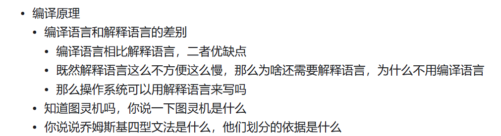
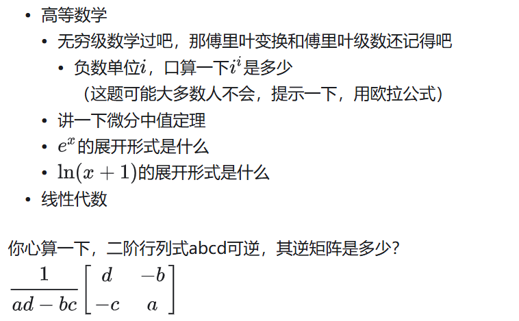
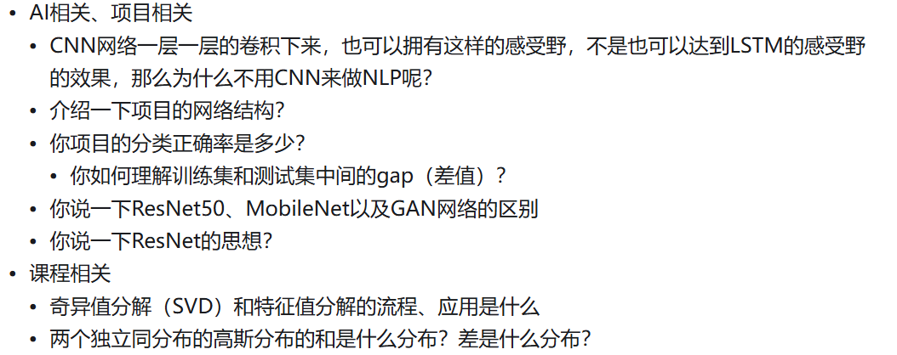

# 专业课问题

## 操作系统

### 中断的分类有哪些？中断的实现过程？

### 文件的共享方式有哪些？

## 编译原理

## 计算机网络

### TCP/IP协议在C/S结构中的作用

## 数据结构

### B树和B+树的区别，有了B树为啥还要提出B+树？

## 数据库

## 软件工程

## 编译原理

# 数学

## 矩阵的秩

# 背景相关

## 你本科学的最好的一门课程是什么，你学到了什么？

## 为什么报考这里，你会什么技能能对以后科研有什么帮助之类的

## 你还有联系过其他哪些老师吗

## 怎么做缓解紧张

## 我们实验室界面有很多方向，你最感兴趣的是哪一个方向？

## 说说你旅游过的地方，其中你最喜欢的地方是哪个？

## please talk about your hometown

## 你最喜欢的课程是哪个？

## 请介绍一下你的科研经历和成果

## 介绍你的大学

# 项目问题

## 过拟合、欠拟合的处理方法

## `VGG`的优点和思想

# AI

# 政治

## 我国的反腐行动如何

## 对于社会核心价值观的了解	
